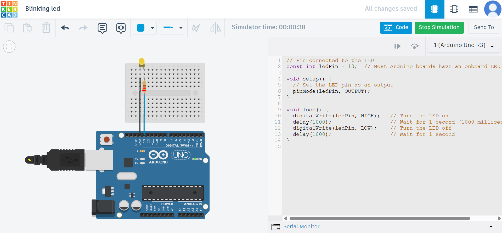

# 💡 Basic LED Blinking – Arduino Project

A beginner-level **IoT and Embedded Systems** project to demonstrate the fundamentals of controlling an LED using an **Arduino Uno**. This project is a foundational exercise for anyone starting out with **hardware programming**, **digital output**, and **microcontroller logic**.

---

## 📌 Project Overview

In this project, we connect a single LED to an Arduino and write a simple sketch to make it blink on and off at regular intervals. This is often referred to as the "**Hello World**" of hardware projects.

---

## 🔧 Components Required

| Component       | Quantity |
| --------------- | -------- |
| Arduino UNO     | 1        |
| LED (any color) | 1        |
| 220Ω Resistor   | 1        |
| Breadboard      | 1        |
| Jumper Wires    | 3        |
| USB Cable       | 1        |

---

## 🧠 Circuit Diagram

> Connect the LED's **anode (longer leg)** to pin 13 of Arduino via a 220Ω resistor.
> Connect the **cathode (shorter leg)** to **GND**.

```
[Pin 13] ----[220Ω Resistor]----|>|---- [GND]
                              LED
```

---

## 📄 Arduino Code

```cpp
const int ledPin = 13; // Built-in LED or external LED connected to pin 13

void setup() {
  pinMode(ledPin, OUTPUT); // Set pin as output
}

void loop() {
  digitalWrite(ledPin, HIGH); // Turn LED ON
  delay(1000);                // Wait 1 second
  digitalWrite(ledPin, LOW);  // Turn LED OFF
  delay(1000);                // Wait 1 second
}
```

---

## ⚙️ How It Works

* The **setup()** function runs once when the board powers on, setting pin 13 as an output.
* The **loop()** function runs continuously, turning the LED on and off with a 1-second delay in between.
* Uses **digitalWrite()** to control voltage output.

---

## 📸 Preview / Demo

> *(Add a picture or short video/gif here if available)*
> Example: LED connected to Arduino blinking on/off every second.

---

## 🎯 Learning Outcomes

* Understanding digital output using `digitalWrite()`
* Working with basic electronics (LEDs and resistors)
* Getting started with Arduino IDE and uploading code
* Building confidence in hardware programming

---

## 📁 Project Directory

```
Basic_LED_Blinking/
├── Basic_LED_Blinking.ino
├── README.md
└── circuit_diagram.png (optional)
```

---

## 🧠 Next Steps / Ideas

* Add a button to control the blinking
* Control blink rate using a potentiometer
* Connect multiple LEDs in sequence or pattern

---

## 👨‍💻 Author

**Ravi Rathor**
IoT & Embedded Developer | Flutter | Full Stack Enthusiast
🔗 [GitHub](#) • [LinkedIn](#) • [Portfolio](#)

---

