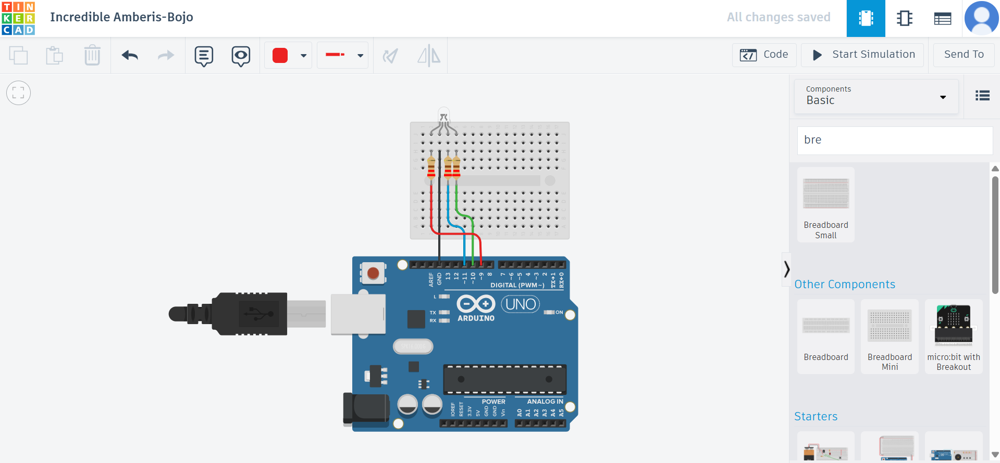

# 🔴🟢🔵 RGB LED Color Control Using Arduino – IoT Mini Project

A simple yet effective **IoT project** using an **Arduino Uno** to control an **RGB LED**, showcasing primary and secondary color cycles through PWM control. Perfect for beginners learning about digital output, pulse-width modulation (PWM), and embedded systems.

---

### 📌 Features

* 🚦 Cycles through 4 colors: Red, Green, Blue, and Purple (Magenta)
* 🔄 Delay-based transitions using `analogWrite()`
* 🧠 Demonstrates use of functions to manage RGB color control
* 🧰 Easily extensible to include other colors or fade effects
* 👨‍💻 Great for learning PWM and RGB color mixing

---

### ⚙️ Components Used

| Component                | Quantity |
| ------------------------ | -------- |
| Arduino UNO              | 1        |
| RGB LED (Common Cathode) | 1        |
| 220Ω Resistors           | 3        |
| Breadboard               | 1        |
| Jumper Wires             | 6+       |
| USB Cable                | 1        |

---

### 🖥️ Circuit Diagram

> **Wiring Summary:**

* Red Pin → Arduino Pin **9** (with 220Ω resistor)
* Green Pin → Arduino Pin **10**
* Blue Pin → Arduino Pin **11**
* Common Cathode → **GND**

You can use [Tinkercad](https://www.tinkercad.com/) or Fritzing to simulate the setup.

---

### 🔌 Arduino Code

```cpp
// Define RGB LED pins
const int redPin = 9;
const int greenPin = 10;
const int bluePin = 11;

void setup() {
  pinMode(redPin, OUTPUT);
  pinMode(greenPin, OUTPUT);
  pinMode(bluePin, OUTPUT);
}

void loop() {
  setColor(255, 0, 0);    // Red
  delay(1000);

  setColor(0, 255, 0);    // Green
  delay(1000);

  setColor(0, 0, 255);    // Blue
  delay(1000);

  setColor(255, 0, 255);  // Purple (Red + Blue)
  delay(1000);
}

void setColor(int redVal, int greenVal, int blueVal) {
  analogWrite(redPin, redVal);
  analogWrite(greenPin, greenVal);
  analogWrite(bluePin, blueVal);
}
```

---

### 🔧 How to Run

1. Connect your components as described.
2. Upload the code using the **Arduino IDE**.
3. Watch the RGB LED cycle through Red → Green → Blue → Purple.

---

### 🚀 Future Enhancements

* Add **color fading effects**
* Control RGB LED via **Bluetooth / Wi-Fi** (ESP32/ESP8266)
* Use **potentiometers** or **buttons** to manually change color
* Add a mobile app interface using **MIT App Inventor**

---

### 📷 Project Preview (Optional)

> Add images or GIFs here showing your real hardware project setup.

---

### 👨‍💻 Author

**Ravi Rathor**
IoT & Embedded Developer | Flutter | Full Stack Enthusiast
[LinkedIn](#) • [GitHub](#) • [Portfolio](#)

